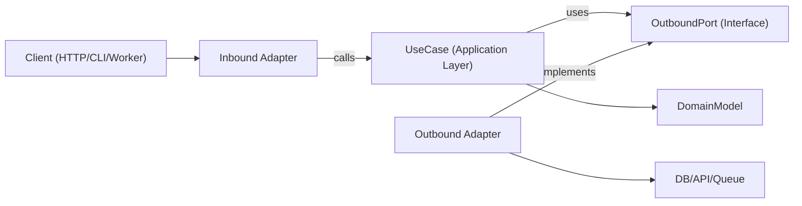

## Architecture Diagram

```mermaid
flowchart LR
  Client["Client (HTTP/CLI/Worker)"] --> InboundAdapter["Inbound Adapter"]
  InboundAdapter -->|"calls"| UseCase["UseCase (Application Layer)"]
  UseCase -->|"uses"| OutboundPort["OutboundPort (Interface)"]
  OutboundAdapter["Outbound Adapter"] -->|"implements"| OutboundPort
  OutboundAdapter --> ExternalSystem["DB/API/Queue"]
  UseCase --> DomainModel["DomainModel"]
```